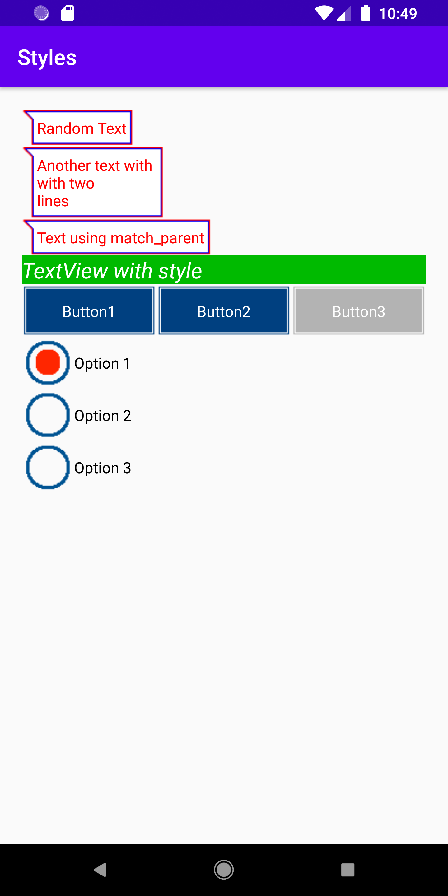

# Styles

In this project I use styles to apply properties to multiple components in the user interface. The style is defined in res/values file and is applied to the components using the tag 'style=@style/STYLE_NAME'. I also use selectors to apply images to components so that they change when clicked or selected. The resource file define the state and images used while the styles.xml file define what changes in component.

